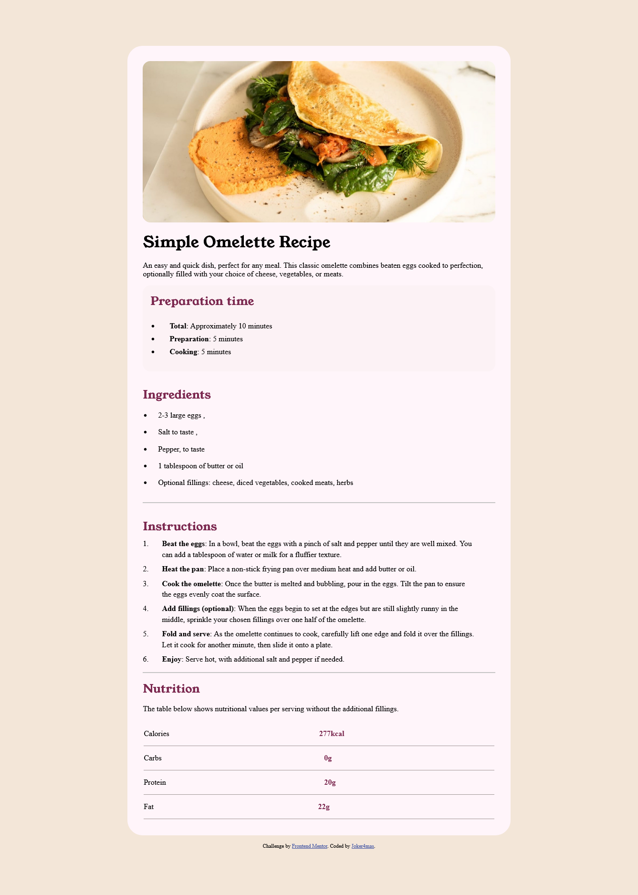

# Frontend Mentor - Recipe page solution

This is a solution to the [Recipe page challenge on Frontend Mentor](https://www.frontendmentor.io/challenges/recipe-page-KiTsR8QQKm). Frontend Mentor challenges help you improve your coding skills by building realistic projects. 

## Table of contents

- [Frontend Mentor - Recipe page solution](#frontend-mentor---recipe-page-solution)
  - [Table of contents](#table-of-contents)
    - [Screenshot](#screenshot)
    - [Links](#links)
  - [My process](#my-process)
    - [Built with](#built-with)
    - [What I learned](#what-i-learned)
    - [Continued development](#continued-development)
  - [Author](#author)


### Screenshot



### Links

- Solution URL: [Add solution URL here](https://github.com/Joker4mas/recipe-FE)
- Live Site URL: [Add live site URL here](https://recipe-fe.netlify.app/)

## My process

### Built with

- Semantic HTML5 markup
- CSS custom properties
- Flexbox
- Mobile-first workflow

### What I learned

I refreshed my knowledge on tables. I want to improve in the usage of tables and also understand how to align and add borders to it.

To see how you can add code snippets, see below:

```html
<table>
    <tbody>
        <tr>
            <td>Calories</td>
            <td>220kg</td>
        </tr>
    </tbody>
</table>
```

### Continued development
I want to continue learning about CSS Flexbox concepts to improve my knowledge and usage of the concepts.

## Author

- Website - [Joker4mas](https://www.github.com/Joker4mas)
- Frontend Mentor - [@Joker4mas](https://www.frontendmentor.io/profile/Joker4maas)
- Twitter - [@Joker4mas](https://www.twitter.com/Joker4mas)
